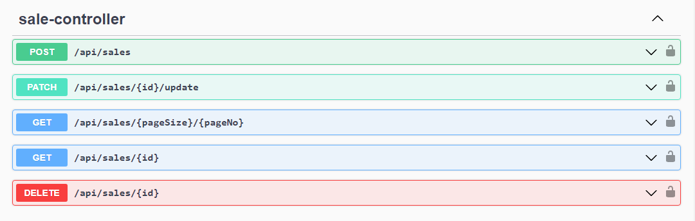

# REST API Jual-Beli Limbah With Java Spring Boot 

Rest Api digunakan untuk pencatatan transaksi usaha limbah yang dibangun menggunakan springboot.

### End-Point yang tersedia

Authentication

Customer

Material

Purchase

Sale

Cash

### Technology Stack

1. Java 17
2. Spring Boot 3.0.8
3. JWT
4. Open Api